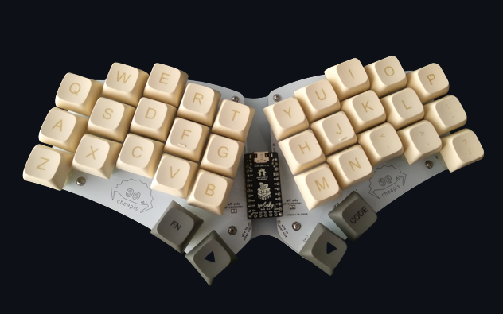

# Cheapis Keyboard ZMK Firmware (shields)


<p align="center">

</p> 

### Colemak Layer (default)
```
╭──────┬──────┬──────┬──────┬──────╮      ╭──────┬──────┬──────┬──────┬──────╮
│  Q   │  W   │  F   │  P   │  G   │      │  J   │  L   │  U   │  Y   │  BSC │
├──────┼──────┼──────┼──────┼──────┤      ├──────┼──────┼──────┼──────┼──────┤
│  A   │  R   │  S   │NAV T │  D   │      │  H   │  N   │  E   │  I   │  O   │
├──────┼──────┼──────┼──────┼──────┤      ├──────┼──────┼──────┼──────┼──────┤
│ALT Z │CTL X │SFT C │  V   │  B   │      │  K   │  M   │SFT , │CTL . │ALT / │
╰──────┴──────┴──────┼──────┼──────┴─╮  ╭─┴──────┼──────┼──────┴──────┴──────╯
                     │LOWER │ SPACE  │  │ SPACE  │RAISE │
                     ╰──────┴────────╯  ╰────────┴──────╯
```

#### Lower Layer

```
 ╭──────┬──────┬──────┬──────┬──────╮         ╭──────┬──────┬──────┬──────┬──────╮
 │ ESC  │      │      │      │      │         │  (   │  )   │  =   │  &   │  |   │
 ├──────┼──────┼──────┼──────┼──────┤         ├──────┼──────┼──────┼──────┼──────┤
 │      │      │      │      │      │         │  {   │  }   │  _   │  $   │   #  │
 ├──────┼──────┼──────┼──────┼──────┤         ├──────┼──────┼──────┼──────┼──────┤
 │      │      │      │      │      │         │  [   │  ]   │  <   │  >   │  \   │
 ╰──────┴──────┴──────┼──────┼──────┴─╮     ╭─┴──────┼──────┼──────┴──────┴──────╯
                      │LOWER │ SPACE  │     │ SPACE  │RAISE │
                      ╰──────┴────────╯     ╰────────┴──────╯
```

#### Raise Layer

```

 ╭──────┬──────┬──────┬──────┬──────╮         ╭──────┬──────┬──────┬──────┬──────╮
 │   /  │  1   │  2   │  3   │  -   │         │  F1  │  F2  │  F3  │  F4  │      │
 ├──────┼──────┼──────┼──────┼──────┤         ├──────┼──────┼──────┼──────┼──────┤
 │   *  │  4   │  5   │  6   │  +   │         │  F5  │  F6  │  F7  │  F8  │   '  │
 ├──────┼──────┼──────┼──────┼──────┤         ├──────┼──────┼──────┼──────┼──────┤
 │   %  │  7   │  8   │  9   │  0   │         │  F9  │  F10 │ F11  │  F1  │      │
 ╰──────┴──────┴──────┼──────┼──────┴─╮     ╭─┴──────┼──────┼──────┴──────┴──────╯
                      │LOWER │ SPACE  │     │ SPACE  │RAISE │
                      ╰──────┴────────╯     ╰────────┴──────╯  
```

#### Space Layer (right)

```

 ╭──────┬──────┬──────┬──────┬──────╮         ╭──────┬──────┬──────┬──────┬──────╮
 │   `  │      │  €   │  £   │  Ğ   │         │      │      │      │      │  DEL │
 ├──────┼──────┼──────┼──────┼──────┤         ├──────┼──────┼──────┼──────┼──────┤
 │   !  │  @   │  Ş   │  ₺   │      │         │      │      │      │      │  "   │
 ├──────┼──────┼──────┼──────┼──────┤         ├──────┼──────┼──────┼──────┼──────┤
 │      │      │  Ç   │      │      │         │      │      │      │      │      │
 ╰──────┴──────┴──────┼──────┼──────┴─╮     ╭─┴──────┼──────┼──────┴──────┴──────╯
                      │LOWER │ SPACE  │     │ SPACE  │RAISE │
                      ╰──────┴────────╯     ╰────────┴──────╯   

```
#### Space Layer (left)

```
 ╭──────┬──────┬──────┬──────┬──────╮         ╭──────┬──────┬──────┬──────┬──────╮
 │      │      │      │      │      │         │      │      │  Ü   │      │   |  │
 ├──────┼──────┼──────┼──────┼──────┤         ├──────┼──────┼──────┼──────┼──────┤
 │      │      │      │      │      │         │      │      │  I   │  I   │   #  │
 ├──────┼──────┼──────┼──────┼──────┤         ├──────┼──────┼──────┼──────┼──────┤
 │      │      │      │      │      │         │      │      │  ^   │  ~   │   \  │
 ╰──────┴──────┴──────┼──────┼──────┴─╮     ╭─┴──────┼──────┼──────┴──────┴──────╯
                      │LOWER │ SPACE  │     │SPC/WIN │RAISE │
                      ╰──────┴────────╯     ╰────────┴──────╯
```
#### Navigation Layer

```

 ╭──────┬──────┬──────┬──────┬──────╮         ╭──────┬──────┬──────┬──────┬──────╮
 │ ESC  │      │      │      │      │         │C_PREV│ PGUP │  UP  │ MPLY │ MUTE │
 ├──────┼──────┼──────┼──────┼──────┤         ├──────┼──────┼──────┼──────┼──────┤
 │      │      │      │NAV T │      │         │ HOME │ LEFT │ DOWN │ RGHT │ END  │
 ├──────┼──────┼──────┼──────┼──────┤         ├──────┼──────┼──────┼──────┼──────┤
 │      │      │      │      │      │         │C_NEXT│PGDOWN│      │VLDOWN│ VLUP │
 ╰──────┴──────┴──────┼──────┼──────┴─╮     ╭─┴──────┼──────┼──────┴──────┴──────╯
                      │LOWER │ SPACE  │     │ SPACE  │RAISE │
                      ╰──────┴────────╯     ╰────────┴──────╯ 
```

#### Adjust Layer

```
 ╭──────┬──────┬──────┬──────┬──────╮         ╭──────┬──────┬──────┬──────┬──────╮
 │      │      │      │      │      │         │      │      │      │      │      │
 ├──────┼──────┼──────┼──────┼──────┤         ├──────┼──────┼──────┼──────┼──────┤
 │      │      │      │      │      │         │      │      │      │      │      │
 ├──────┼──────┼──────┼──────┼──────┤         ├──────┼──────┼──────┼──────┼──────┤
 │      │      │      │      │      │         │ RESET│ BOOT │      │      │      │
 ╰──────┴──────┴──────┼──────┼──────┴─╮     ╭─┴──────┼──────┼──────┴──────┴──────╯
                      │LOWER │ SPACE  │     │ SPACE  │RAISE │
                      ╰──────┴────────╯     ╰────────┴──────╯ 

```

# Hardware
- [Cheapis](https://github.com/dotleon/cheapis)
- [Splinky](https://github.com/Bastardkb/Splinky)